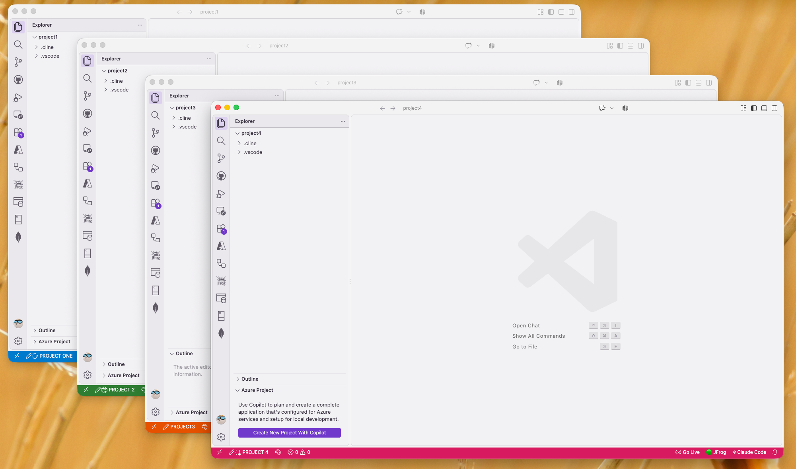

# Status Quo
_Simple Status Bar Customizer_

---

Working with multiple VS Code windows at the same time? _Status Quo_ makes it easy to give some personality to each of the window so you can quickly identify them at a glance. Show your own text in the VS Code status bar and give each project its own status bar color. 

## Features

- **Custom status bar text.** Click the text item in the left of the status bar to edit it. The text can't be empty, and surrounding whitespace is trimmed.
- **Per-project status bar color.** Click the palette icon next to it to choose a color:
  - Eight preset colors — Blue, Green, Purple, Orange, Red, Teal, Pink and Gray — each shown with a color swatch
  - A color picker with a live preview of your status bar
  - A hex input (`#ff8800`, `#f80`, or without the `#`)
  - Reset to your theme's default
- **Remembers your current color.** The list highlights it, and the color picker and hex input both open on it. If your current color isn't one of the presets, it's shown at the top of the list.
- **Icons in your text.** Use VS Code's built-in [codicons](https://microsoft.github.io/vscode-codicons/dist/codicon.html) with `$(name)` syntax — `$(coffee) Brew`, `$(snake) api`, `$(rocket) Deploy`.
- **Readable text automatically.** The status bar foreground switches between black and white depending on how light the background is.

## Screenshot

## Install

From the Extensions view (`Cmd/Ctrl+Shift+X`), search for **Status Quo**, or install it from the [Visual Studio Marketplace](https://marketplace.visualstudio.com/items?itemName=ashisha7i.status-quo).

## Usage

Open a folder or workspace, then use either the status bar items or the Command Palette (`Cmd/Ctrl+Shift+P`):

| Command | What it does |
| --- | --- |
| `Status Quo: Edit Text` | Change the text shown in the status bar |
| `Status Quo: Change Color` | Pick, enter, or reset the status bar color |

The extension loads once VS Code has finished starting up. The status bar items only appear when a folder or workspace is open — running a command without one shows a message with an **Open Folder** button.

### Using icons

Your status bar text can include any of VS Code's built-in **codicons** using `$(icon-name)` syntax. Mix them with plain text however you like:

| Text you enter | Shows as |
| --- | --- |
| `$(coffee) Brew` | a coffee cup followed by “Brew” |
| `$(snake) api` | a snake followed by “api” |
| `$(rocket) Deploy` | a rocket followed by “Deploy” |
| `$(database)` | just the icon, no text |

Browse the full set in the [codicon reference](https://microsoft.github.io/vscode-codicons/dist/codicon.html). Useful ones for labelling projects include `$(beaker)`, `$(bug)`, `$(cloud)`, `$(flame)`, `$(gear)`, `$(globe)`, `$(server)`, `$(terminal)` and `$(warning)`.

Icons are rendered by VS Code itself, so the color picker's preview shows the raw `$(coffee)` text rather than the icon. The status bar will show it correctly.

### Choosing a color

Selecting **Open color picker...** opens a panel in an editor tab (not a popup) with a native color picker, a hex field, and a preview of how your status bar will look. Click **Apply** to save, or **Cancel** — or just close the tab — to leave things as they are.

## Where settings are stored

Everything is saved at the **workspace level only**. Your user (global) settings are never modified.

- Single folder open: `.vscode/settings.json`
- `.code-workspace` file open: the `settings` section of that file

The extension writes two keys:

- `workbench.colorCustomizations` → `statusBar.background` and `statusBar.foreground`
- `statusQuo.text`

Other entries in `workbench.colorCustomizations` are left untouched. If you don't want these settings committed, add `.vscode/settings.json` to your `.gitignore`.

## Extension settings

| Setting | Default | Description |
| --- | --- | --- |
| `statusQuo.text` | `Click to edit` | The text shown in the status bar (workspace setting) |

## Known limitations

- A folder or workspace must be open. There is no global (all-projects) mode.
- "Current color" means the color this extension saved in the workspace settings. A status bar color coming from your theme or user settings is not detected.
- The color picker's preview shows `$(icon-name)` as plain text. Icons only render in the status bar itself.
- Colors must be 3- or 6-digit hex (`#f80`, `#ff8800`; the `#` is optional). Named colors like `red` and formats like `rgb()` or `hsl()` aren't supported.

## Requirements

VS Code 1.85.0 or newer.

## Contributing

Issues and pull requests are welcome at [github.com/ashisha7i/vscode-status-quo](https://github.com/ashisha7i/vscode-status-quo).

The extension is a single `extension.js` file with no dependencies and no build step. To try your changes, open the repo in VS Code and press `F5` to launch an Extension Development Host.

## Release notes

See the Changelog tab on this page for what changed in each version.

## License

[MIT](LICENSE)
